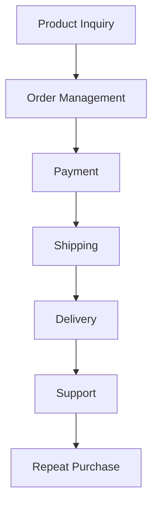

# 07_Customer_Journey — Dayjoy Customer & Distributor Journey

> **Status:** VERIFIED / PARTIALLY VERIFIED / UNKNOWN / REQUIRES CLIENT INPUT  
> **Last updated:** 2026-08-04  
> **Primary sources:** Official Dayjoy FAQs, Shipping Policy, Terms, Contact page, Compliance Documents, Downloads, and the research documents from Missions 1–6.

---

## 1. Journey Overview

### 1.1 Purpose

**VERIFIED:** Map the full customer and distributor experience from first awareness to long-term loyalty so Dayjoy can design Voice AI, WhatsApp AI, Website AI, Internal AI, CRM workflows, and sales automation. [web:14][web:59][web:3][web:35][file:06_FAQs][file:08_Business_Processes]

### 1.2 Scope

**VERIFIED:** Includes customer, prospect, distributor prospect, active distributor, and support-user journeys across awareness, product research, ordering, shipping, delivery, usage, support, repeat purchase, referral, and loyalty. [file:06_FAQs][file:08_Business_Processes][file:10_Pain_Points]

### 1.3 Stakeholders

- Customers and prospects
- Distributors and distributor prospects
- Customer support team
- Business support team
- Operations / logistics
- Compliance / grievance function
- Management / leadership [web:3][web:67][file:04_Distributor_System]

### 1.4 AI Systems That Will Use This Document

- Voice AI (Vapi)
- WhatsApp AI
- Website AI Assistant
- Internal Employee AI
- Distributor AI Assistant
- CRM workflows
- Sales automation
- Customer support automation
- Analytics and BI [file:11_AI_Opportunities]

---

## 2. Customer Personas

### 2.1 New Customer

**Goals:** Find a relevant product, understand benefits and safety, place first order.  
**Motivations:** Health, beauty, convenience, trusted guidance.  
**Pain Points:** Product complexity, policy confusion, shipping uncertainty. [file:10_Pain_Points][file:06_FAQs][web:14]  
**Preferred Channels:** Website, WhatsApp, phone support, distributor.

### 2.2 Returning Customer

**Goals:** Reorder, compare products, get faster support.  
**Motivations:** Familiarity, trust, convenience.  
**Pain Points:** Repeat ordering friction, tracking and returns, refund delays. [web:59][web:14]

### 2.3 Interested Prospect

**Goals:** Learn about Dayjoy, validate legitimacy, product quality, and pricing.  
**Motivations:** Interest in wellness products and brand trust.  
**Pain Points:** Overcoming MLM skepticism, understanding product claims. [web:14][web:69][web:119]

### 2.4 Distributor Prospect

**Goals:** Learn joining process, earnings potential, training, and compliance.  
**Motivations:** Entrepreneurship, supplemental income.  
**Pain Points:** Compensation complexity, KYC requirements, unclear expectations. [web:68][web:69][web:35]

### 2.5 Active Distributor

**Goals:** Sell products, onboard customers, build teams, earn commissions.  
**Motivations:** Income, rank growth, recognition.  
**Pain Points:** Training load, product knowledge, reporting, commission understanding. [web:68][web:35][file:10_Pain_Points]

### 2.6 Customer Support User

**Goals:** Resolve issue fast.  
**Motivations:** Refunds, delivery help, product complaint.  
**Pain Points:** Response delays, repetitive explanations, escalation complexity. [web:14][web:3]

---

## 3. Customer Journey Map

> Journey stages are a combined view from official FAQs, policy pages, and process docs.

### 3.1 Journey Stages Table

| Stage | Customer Goals | Customer Actions | Company Interactions | Channels | Emotions | Pain Points | AI Opportunities | Success Metrics |
|---|---|---|---|---|---|---|---|---|
| Awareness | Discover Dayjoy | Sees posts, distributor references, website | Brand messaging, social posts | Website, social, distributor, WhatsApp | Curious | Credibility, unclear value proposition | AI content assistant, credibility explainer | Click-through rate, lead capture |
| Interest | Learn more | Visits site, asks questions | FAQ, support, distributor answers | Website, phone, WhatsApp | Interested | Too much info, jargon | Website AI, FAQ bot | FAQ resolution rate |
| Product Research | Compare products | Reads product pages, brochures | Product pages, leaflets, brochure | Web, PDF, distributor | Analytical | Missing ingredients, safety, usage | Product expert AI | Time-to-decision |
| Product Comparison | Compare options | Weighs benefits, price, category | Recommendations, cross-sell | Web, WhatsApp, distributor | Cautious | No comparison engine | Recommendation AI | Conversion rate |
| Purchase Decision | Decide to buy | Confirms product and channel | Support or distributor guidance | Web, phone, WhatsApp | Motivated | Price and policy uncertainty | Purchase assistant | Checkout completion |
| Order Placement | Place order | Submits order or asks distributor | Order creation, confirmation email | Website, office, distributor | Hopeful | Steps unclear | Ordering assistant | Order success rate |
| Payment | Pay safely | Uses card/DD/cash/gateway | Payment authorization, invoice | Website, office | Concerned | Failed payment, trust | Payment assistant | Payment success rate |
| Shipping | Wait for dispatch | Monitors order | Dispatch and logistics | SMS/email/support | Impatient | Tracking gap, timeline uncertainty | Order tracking AI | Dispatch time, support deflection |
| Delivery | Receive product | Accepts shipment | Delivery confirmation | Courier, phone | Relieved | Damage, delay | Delivery status assistant | On-time delivery |
| Product Usage | Use product | Follows instructions | Product guidance / consultation | FAQ, distributor, support | Confident / uncertain | Usage questions | Product usage AI | Reduced complaints |
| Customer Support | Resolve issue | Calls/messages support | Ticketing, escalation | Phone, WhatsApp, email | Frustrated | Response delays | Support AI | FCR, TAT, CSAT |
| Repeat Purchase | Reorder | Buys again | Loyalty / reorder process | Web, distributor | Comfortable | Reorder friction | Reorder assistant | Repeat purchase rate |
| Referral | Recommend others | Shares with friends | Distributor outreach | Social, WhatsApp | Proud | Inconsistent messaging | Referral assistant | Referral conversion |
| Loyalty | Stay engaged | Continues use and buying | Offers, support, training | App/web/WhatsApp | Loyal | Long-term engagement | Loyalty AI | Retention rate |

### 3.2 Customer Journey Flow Diagram

---

## 4. Distributor Journey

### 4.1 Stages

| Stage | Objectives | Activities | Pain Points | AI Support Opportunities |
|---|---|---|---|---|
| Discovery | Learn about business opportunity | Sees posts, talks to distributor | Trust, skepticism, income uncertainty | Business explainer AI, income realism AI |
| Registration | Join the program | Fills application, submits KYC | KYC friction, unclear steps | Onboarding assistant, document checker |
| Verification | Get approved | KYC review, PAN validation | Delays, missing docs | KYC automation |
| Training | Learn products/business | Downloads modules, attends sessions | Training overload | Training assistant, personalized learning |
| First Order | Start business | Buys starter products / orders | Confusing DP/MRP, pack selection | Order assistant, comp explainer |
| Selling Products | Acquire customers | Share products and recommendations | Product knowledge gaps | Sales coach, recommendation engine |
| Customer Management | Support customers | Track questions, complaints | Repetitive support | Distributor copilot |
| Commission | Understand earnings | Track BV/PV, incentives | Comp complexity | Commission explainer/calculator |
| Business Growth | Build team & ranks | Recruit, train, motivate | Attrition, inconsistent follow-up | Coaching AI, analytics dashboard |
| Renewal / Continuity | Stay active | Maintain business activity | Motivation decay | Retention and goal reminders |

### 4.2 Distributor Journey Diagram

---

## 5. Customer Touchpoints

| Touchpoint | Purpose | Typical Intent | AI Capability | Human Involvement |
|---|---|---|---|---|
| Website | Research, ordering, support | Product info, FAQs, policies | Website AI Assistant | Support escalation |
| WhatsApp | Quick help, order status | FAQs, order, complaint | WhatsApp AI | Support team fallback |
| Voice Calls | Live support | Urgent help, guidance | Voice AI (Vapi) | Human agent for complex cases |
| Social Media | Awareness, referrals | Product discovery, trust | AI content assistant | Community manager |
| Email | Support, follow-up | Complaints, updates | AI email assistant | Human agent for exceptions |
| Distributor | Sales & onboarding | Product advice, business join | Distributor AI copilots | Human relationship |
| Customer Support | Problem resolution | Returns/refunds/complaints | Support AI | Human escalation |
| Events | Training & motivation | Business building | Event assistant | Trainers / leaders |
| Marketing Campaigns | Lead generation | Offers, launches | Campaign AI | Marketing team review |

---

## 6. Communication Channels

| Channel | Primary Use | Advantages | Limitations | AI Role | Escalation Process |
|---|---|---|---|---|---|
| Phone | Urgent support | Fast, personal | Hard to scale | Voice AI | Human agent/Grievance Officer |
| WhatsApp | Convenience | Familiar, quick | Can become noisy | Chat AI | Agent transfer |
| Email | Formal issues | Record keeping | Slower | Draft/triage AI | Human follow-up |
| Website | Self-service | Scalable, searchable | Needs good UX | Web AI | Ticket creation |
| Distributor | Relationship sales | Trust, local support | Message inconsistency | Distributor copilot | Support team |
| In-person / franchise | Hands-on support | Strong guidance | Limited reach | Self-service + tablets | Staff assistance |

---

## 7. Customer Questions by Journey Stage

### Awareness / Interest
- What is Dayjoy?
- Is Dayjoy legitimate?
- How do I contact Dayjoy?
- What products do you sell?

### Product Research
- What ingredients are in this product?
- Is this product safe?
- What is it used for?
- How should I use it?

### Comparison / Purchase
- Which product is best for me?
- How much does it cost?
- Can I buy online?
- Is shipping free?

### Shipping / Delivery
- Where is my order?
- When will it arrive?
- What if it’s damaged?

### Support / Returns
- Can I return it?
- How long is refund processing?
- How do I cancel the order?

### Distributor
- How do I become a distributor?
- What documents are needed?
- How much can I earn?

### Employee / Internal
- Which policy applies here?
- Where do I find the latest form?
- How do I escalate this complaint?

---

## 8. Pain Points by Journey Stage

| Stage | Pain Point | Cause | Impact | Current Handling | AI Improvement |
|---|---|---|---|---|---|
| Product Research | Too much info / too little guidance | Many docs, jargon | Decision delay | Distributors/support | Product expert AI |
| Purchase | Unclear order steps | Multiple channels | Abandonment | Support guidance | Ordering assistant |
| Shipping | No real-time status | Tracking not public | Anxiety | Support calls | Tracking AI |
| Returns | Policy confusion | Complex rules | Disputes | Manual support | Policy explainer |
| Refunds | Wait time | 15-day process | Frustration | Manual follow-up | Refund workflow AI |
| Distributor Onboarding | KYC friction | Manual verification | Drop-offs | Support/manual | Onboarding assistant |
| Compensation | Comp-plan complexity | Many incentives | Confusion | Training PDFs | Comp calculator |

---

## 9. Business Process Integration

**VERIFIED:** Customer journey maps directly to these processes: product inquiry, order management, shipping, returns, refunds, complaints, distributor registration, training, and customer support. [file:08_Business_Processes]

---

## 10. AI Automation Opportunities

| Journey Stage | AI Capability | Business Benefit | Priority |
|---|---|---|---|
| Awareness | Content recommendation | Better lead capture | High |
| Product Research | Product expert RAG | Faster decisions | Very High |
| Comparison | Recommendation engine | Higher conversion | Very High |
| Purchase | Order assistant | Lower abandonment | High |
| Payment | Payment helper | Fewer failures | Medium |
| Shipping | Order tracking AI | Lower support load | Very High |
| Returns / Refunds | Policy + workflow AI | Faster resolution | Very High |
| Support | Voice/WhatsApp AI | 24/7 support | Very High |
| Distributor onboarding | KYC assistant | Faster activation | High |
| Repeat purchase | Reorder assistant | Better retention | High |

---

## 11. Human Handoff Strategy

**VERIFIED:** Human escalation is required for money back claims, product damage disputes, price discrepancy complaints, false language/forced purchase complaints, distributor misconduct, and formal grievances. [web:14][web:3][web:69]

**Handoff triggers:**
- Low AI confidence
- Sensitive legal or compliance issues
- Refund exceptions
- Payment disputes
- Complaint sentiment escalation
- Identity verification failure

---

## 12. Success Metrics

- Response time
- Resolution time
- First contact resolution
- CSAT
- NPS
- Lead conversion rate
- Order completion rate
- Repeat purchase rate
- Distributor onboarding completion rate
- Support ticket deflection rate
- Escalation rate
- Training completion rate

---

## 13. Research Gaps

| Gap | Status |
|---|---|
| Offline journey details (events, franchises) | UNKNOWN |
| Exact touchpoint SLA per channel | UNKNOWN |
| CRM-based customer lifecycle rules | REQUIRES CLIENT INPUT |
| Channel attribution across WhatsApp/phone/web | UNKNOWN |
| Distributor referral workflow detail | PARTIALLY VERIFIED |
| Real-time support routing rules | REQUIRES CLIENT INPUT |

---

## 14. Source Index

- FAQs: [web:14]
- Shipping Policy: [web:59]
- Contact: [web:3]
- Terms of Use: [web:4]
- Terms & Conditions: [web:69]
- Compliance Documents: [web:67]
- Downloads: [web:35]
- Pain Points / AI Opportunities / Business Processes docs: [file:10_Pain_Points][file:11_AI_Opportunities][file:08_Business_Processes]

---

**END OF DOCUMENT**
