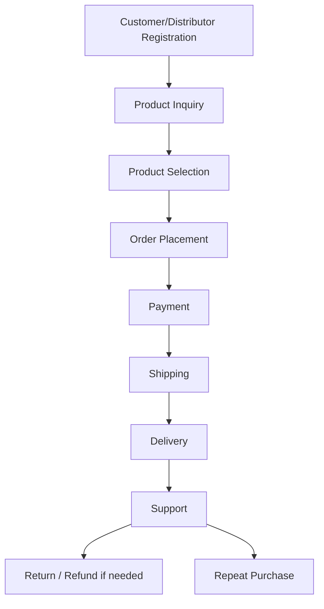

# 08_Business_Processes — Dayjoy Business Process Blueprint

> **Status:** VERIFIED / PARTIALLY VERIFIED / UNKNOWN / REQUIRES CLIENT INPUT  
> **Last updated:** 2026-08-04  
> **Primary sources:** Official Dayjoy Shipping Policy, Terms of Use, Terms & Conditions, FAQs, Compliance Documents, Downloads, and related research documents.

---

## 1. Business Process Overview

### 1.1 Purpose

**VERIFIED:** Define Dayjoy’s operational blueprint so AI, CRM, ERP, workflow automation, and support systems can be designed consistently. [web:59][web:4][web:69][file:07_Customer_Journey][file:10_Pain_Points]

### 1.2 Scope

Customer-facing, distributor-facing, support, operations, and approval workflows: product inquiry, customer registration, distributor registration, ordering, payment, shipping, returns, refunds, complaints, support, training, marketing, approvals. [web:14][web:59][web:69][web:67][web:35]

### 1.3 Stakeholders / Departments

- Sales
- Customer Support
- Operations / Logistics
- Finance
- Compliance / Grievance
- Training / Distributor Support
- IT / Digital Platform
- Management [web:3][web:67][file:04_Distributor_System]

---

## 2. Product Inquiry Process

**Trigger:** Customer/prospect asks about a product. [web:14][web:35]

**Inputs:** Product page, brochure, FAQs, personal need, distributor guidance.

**Workflow:**
1. Customer asks a question via web, WhatsApp, phone, or distributor.
2. AI or human support retrieves product data and related FAQs.
3. If needed, a consultation is offered (24-hour TAT; 48-hour prescription analysis for serious cases). [web:14]
4. Recommendation is given.
5. Prospect proceeds to comparison or purchase.

**AI Opportunities:** product recommendation engine, product expert RAG, multilingual explanation.

**Success Metrics:** inquiry-to-purchase conversion, response time, FAQ deflection.

**Status:** VERIFIED / PARTIALLY VERIFIED

---

## 3. Customer Registration Process

**Trigger:** Customer wants to register / create a purchase account or be recognized in CRM.

**Inputs:** Name, contact, email, address, consent.

**Workflow:**
1. Customer provides details.
2. System validates inputs.
3. Welcome communication is sent.
4. CRM entry is created.

**Gap:** Exact customer self-registration flow is not fully public. **UNKNOWN / REQUIRES CLIENT INPUT.** [web:4][web:73]

---

## 4. Distributor Registration Process

**VERIFIED:** Dayjoy allows independent distributors to join free, subject to age/KYC/PAN rules and company acceptance. [web:69][web:68]

**Workflow:**
1. Prospect accesses application form.
2. Submits KYC and PAN.
3. Company verifies details.
4. Application is approved or rejected at company discretion.
5. Unique distributor ID / business centre is assigned.
6. Welcome and training materials are provided. [web:35][web:69]

**Key Rules:** 18+, sound mind, no conviction, no other direct selling company representation, one Business Centre per PAN. [web:69]

**AI Opportunities:** onboarding assistant, document checker, approval workflow automation.

---

## 5. Product Ordering Process

**VERIFIED:** Orders may be placed online, at office/franchisee outlets, or through distributors. [web:59][web:14]

**Workflow:**
1. Product selection.
2. Cart / order form.
3. Checkout.
4. Payment authorization.
5. Acknowledgement email.
6. Dispatch after confirmation.
7. Delivery to customer. [web:4][web:59]

**Business Rules:** Acknowledgement email is not acceptance; contract is formed upon dispatch confirmation. [web:4]

**AI Opportunities:** order assistant, payment helper, order confirmation bot.

---

## 6. Payment Process

**VERIFIED:** Accepted modes include Cash, Demand Draft, Credit Card, Debit Card; online payment uses a payment gateway. [web:59][web:4]

**Workflow:**
1. Customer selects payment mode.
2. Authorization check occurs.
3. Payment captured.
4. Invoice / acknowledgement sent.
5. If payment fails, support/manual handling is needed.

**Gap:** Payment gateway provider and failure workflow are unknown. **UNKNOWN / REQUIRES CLIENT INPUT.**

**AI Opportunities:** payment assistant, failed-payment helper, invoice bot.

---

## 7. Shipping Process

**VERIFIED:** Orders are usually shipped next business day; average delivery is 2–7 days. Weekend and holiday rules apply. [web:59]

**Workflow:**
1. Order packed.
2. Courier / delivery partner assigned.
3. Shipment dispatched.
4. Tracking / delivery confirmation.
5. Exceptions handled (damage, delay, failed delivery). [web:59]

**Rule:** Hidden damage or discrepancy must be reported within 24 hours. [web:59]

**AI Opportunities:** order-tracking AI, delay alerts, proactive delivery communication.

---

## 8. Return Process

**VERIFIED:** 30-day cooling-off / buyback policy applies; GST-billed stock return limitations exist. [web:69][web:14]

**Workflow:**
1. Return request submitted.
2. Eligibility verified (date, condition, policy).
3. Return approved/denied.
4. Pickup / return shipment.
5. Inspection.
6. Refund or exchange.
7. Closure.

**AI Opportunities:** return eligibility bot, policy checker, return ticket automation.

---

## 9. Refund Process

**VERIFIED:** Refunds take 15 business days; cancellation must occur within 24 hours before dispatch. [web:14]

**Workflow:**
1. Refund request logged.
2. Validation against policy.
3. Approval.
4. Finance processing.
5. Notification to customer.
6. Completion.

**AI Opportunities:** refund status AI, refund calculator, exception routing.

---

## 10. Complaint Resolution Process

**VERIFIED:** Support and grievance contact points exist; money back claims require 1mg.com before/after report and consultation frequency. [web:14][web:3]

**Workflow:**
1. Complaint submitted.
2. Classified (delivery, damage, price discrepancy, product complaint, misconduct).
3. Investigation.
4. Escalation to Grievance Officer if needed.
5. Resolution.
6. Closure and feedback.

**AI Opportunities:** complaint triage, sentiment analysis, SLA routing.

---

## 11. Customer Support Process

**VERIFIED:** Customer Care, WhatsApp support, email support, and grievance officer are publicly listed. [web:3][web:14]

**Workflow:** incoming query → AI answer or ticket → human escalation → resolution → feedback.

**AI Opportunities:** voice AI, WhatsApp AI, FAQ bot, internal agent assist.

---

## 12. Distributor Support Process

**VERIFIED:** Distributor support includes training materials, business support, compensation plan, and direct support contacts. [web:35][web:68][web:3]

**Workflow:** support request → product/business guidance → compensation clarification → technical help → escalation.

**AI Opportunities:** distributor assistant, comp explainer, training tutor.

---

## 13. Training Process

**VERIFIED:** Training materials are available in downloads, including product training modules, business workshops, business opportunity program, and leaflets. [web:35]

**Workflow:**
1. Training content assigned.
2. Distributor/customer reviews module.
3. Training completion tracked.
4. Optional certification / acknowledgement.

**Gap:** Certification logic and tracking are not fully documented. **UNKNOWN**.

---

## 14. Marketing Campaign Process

**VERIFIED:** Dayjoy uses website, social, SMS, email, WhatsApp, and distributor-led promotion; terms require approved communications. [web:4][web:69]

**Workflow:** campaign planning → content creation → compliance review → promotion → lead capture → follow-up → reporting.

**AI Opportunities:** content generation, campaign assistant, lead scoring.

---

## 15. Internal Approval Processes

| Approval | Trigger | Known Rules | Status |
|---|---|---|---|
| Refund approval | Valid refund request | 15 business days timeline, policy conditions | PARTIALLY VERIFIED |
| Return approval | Valid return request | 30-day cooling period, product condition | PARTIALLY VERIFIED |
| Distributor approval | New application | KYC/PAN, company discretion | VERIFIED |
| Complaint escalation | Sensitive complaint | Grievance officer / legal route | VERIFIED |
| Policy exception | Non-standard case | Company discretion | UNKNOWN |

---

## 16. Business Rules

### 16.1 Validation Rules
- 18+ age for distributors. [web:69]
- KYC and PAN required. [web:69]
- One Business Centre per PAN. [web:69]
- Shipping discrepancy claims within 24 hours. [web:59]

### 16.2 Approval Rules
- Company may accept/reject distributor applications. [web:69]
- Refunds/returns follow company policy and compliance rules. [web:14][web:69]

### 16.3 Escalation Rules
- Grievance Officer handles serious complaints. [web:3]
- Legal disputes may go to arbitration in Kota. [web:69]

### 16.4 Compliance Rules
- No misleading income claims; no unapproved online selling; no repacking/tampering. [web:69]

---

## 17. AI Automation Opportunities

| Business Process | AI Capability | Integration Needed | Human Approval | Priority |
|---|---|---|---|---|
| Product inquiry | Product expert AI | RAG KB | No (standard), Yes (medical edge cases) | Very High |
| Distributor registration | Onboarding assistant | CRM/KYC | Yes | Very High |
| Product ordering | Order assistant | Order system | No | High |
| Payment | Payment helper | Payment gateway | Yes for disputes | High |
| Shipping | Tracking AI | Logistics API | No | Very High |
| Returns | Return eligibility AI | Order/CRM | Yes for exceptions | Very High |
| Refunds | Refund status AI | Payment API | Yes for exceptions | Very High |
| Complaints | Complaint triage AI | Ticketing | Yes | High |
| Customer support | Voice/WhatsApp AI | WhatsApp/Vapi | Yes for complex cases | Very High |
| Training | Training assistant | Knowledge base | No | High |

---

## 18. Business Process Dependencies

---

## 19. Process KPIs

- Registration completion rate
- Lead conversion rate
- Order processing time
- Payment success rate
- Shipping time (2–7 days average) [web:59]
- Complaint resolution time (24h call-back, 2–3 day email) [web:14]
- CSAT
- Distributor onboarding completion
- Return approval rate
- Refund cycle time (15 business days) [web:14]

---

## 20. Risks & Failure Scenarios

| Process | Common Failure | Business Risk | Customer Impact | Recovery | AI Fallback |
|---|---|---|---|---|---|
| Ordering | Wrong product / failed order | Lost sale | Frustration | Support correction | Order assistant |
| Shipping | Delay / damage | Trust loss | Complaint | Replacement/refund | Tracking alerts |
| Returns | Eligibility dispute | Support cost | Frustration | Manual review | Policy AI |
| Refunds | Delay | Brand damage | Dissatisfaction | Finance follow-up | Refund status AI |
| Complaints | Slow escalation | Legal risk | Low trust | Grievance officer | Triage AI |
| Distributor verification | Incomplete KYC | Onboarding failure | Delay | Document resubmission | KYC assistant |

---

## 21. AI Knowledge Requirements

### 21.1 Static Knowledge
- Policies
- FAQs
- Product descriptions
- Training leaflets
- Process overviews [web:14][web:59][web:35][web:67]

### 21.2 Dynamic Information
- Order status
- Refund status
- Inventory
- Distributor earnings / BV / PV
- Support ticket status
- Delivery tracking

### 21.3 Authentication Required
- Distributor earnings
- Customer order details
- Personal data access
- Complaint history

### 21.4 Human Escalation
- Money back claims
- Product damage disputes
- Price disputes
- Legal complaints
- Distributor misconduct

---

## 22. Missing Information

- Exact CRM/ERP/back-office systems.  
- Order tracking implementation.  
- Support SLAs per channel.  
- Internal role assignments for approvals.  
- Inventory integration.  
- Certification tracking for training.  
- Exception workflows for partial shipments/backorders.

All are **UNKNOWN** or **REQUIRES CLIENT INPUT**.

---

## 23. Source Index

- Shipping Policy [web:59]
- FAQs [web:14]
- Terms of Use [web:4]
- Terms & Conditions [web:69]
- Compliance Documents [web:67]
- Downloads [web:35]
- Contact [web:3]
- Pain Points / Journeys / AI docs [file:07_Customer_Journey][file:10_Pain_Points][file:11_AI_Opportunities]

---

**END OF DOCUMENT**
